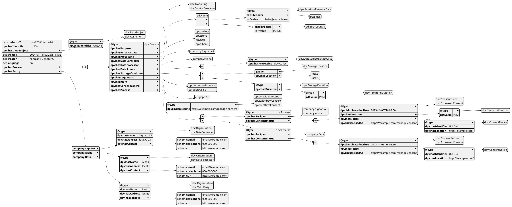

# Consent Record Schema

Providing a practical schema for the implementation of consent records and receipts as defined in the [ISO/IEC TS 27560:2023 Consent record information structure](https://www.iso.org/standard/80392.html) using the [Data Privacy Vocabulary (DPV)](https://w3id.org/dpv) based on [this implementation guide](https://w3id.org/dpv/guides/consent-27560)

## Motivation

The ISO/IES TS 27560:2023 Consent records and receipts technical specification lists the fields that must be present in a consent record, and suggests a loosely defined 'structuring' of these fields within sections. To enable expressing the information in an interoperable manner using (semantic web) standards, the Data Privacy Vocabulary (DPV) provides the necessary concepts and relations to express the information in the form of a 'knowledge graph' which can be encoded in JSON-LD or other RDF-compatible formats such as XML. The use of DPV for conent records and receipts is defined in an implementation guide which outlines which fields in the ISO/IEC standard correspond to which concept/relation within DPV, and also how both can be used for implementing consent records as per GDPR.

However, the ISO standard and the DPV guide leave a lot of ambiguity in terms of how the records are actually structured, how to express specific information i.e. in terms of the data structure, and more importantly - how to ensure that such records as interoperable. The primary challenge of interoperable consent records (and by extension - receipts) lies in the lack of a well-defined schema that dictates exactly how the record should be structured. Without this, each adopter (e.g. service provider) will create consent records using their own ad-hoc consent record schema - which raises several problems:

- The record is not readily interpretable by anyone except the entity that created it
- The lack of consistency and assurance of interpretation means there won't be compatible common tooling, platforms, or infrastructure developed that anyone can use and benefit from
- Individuals (or data subjects) whose consent is being described in these records cannot understand of use the information without a well-defined schema
- Organisations that want to support consent records and receipts will need to expend time and resources to create and maintain their own schema - as well as ensure its compatibility with the standards and other organisations' schemas

To address these, our proposed solution is to create:

- A 'fixed' or 'concrete' schema for expressing and validating consent records and receipts in a consistent and unambigious manner using JSON and JSON-LD through which each entity can import/export their records/receipts with assurance of consistency in interpretation and interoperability of data;
- Validators for checking and ensuring consent records and receipts follow ISO/IEC TS 27560, DPV, and the schema defined in this repository that enable entities to ensure their data is conformant to this repository's specifications

## Authorship and Copyright

The authors of this work are:

- Harshvardhan J. Pandit (ADAPT Centre, Dublin City University)
- Georg P. Krog (Signatu AS)
- Torgeir Hovden (Signatu AS)

The work is being published under an Apache 2.0 License which enables its open and permissible reuse. See the LICENSE file for more information.
